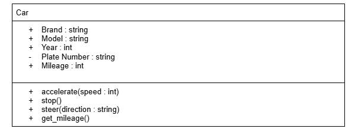
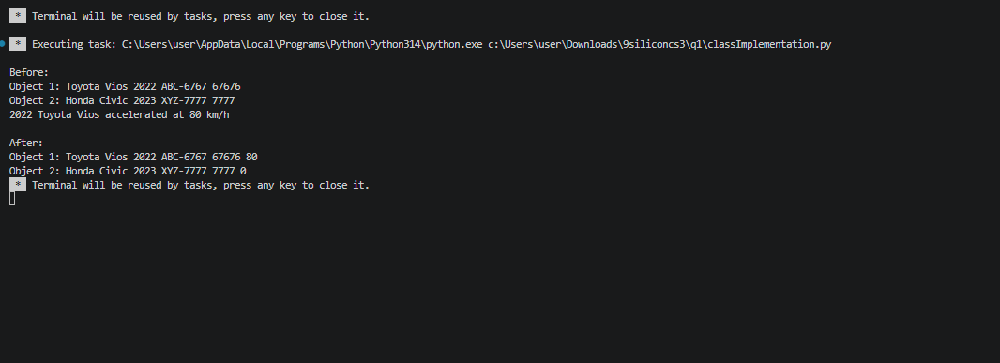
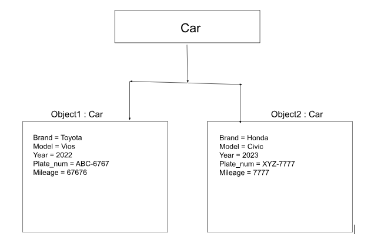

# Class Attributes and Methods
## Previous Design
Link to my previous activity:
[classObjectUML.md](classObjectUML.md)
## Design Revision
Changes from my previous design:
-added get_mileage in methods
## Visibility Decisions
| Attribute | Data Type | Visibility | Reason |
|---|---|---|---|
| Brand | string | Public | It can be accessed to identify the brand of the car |
| Model | string | Public | It can be accessed to identify the model of the car |
| Year | int | Public | It can be accessed to identify the year of the car |
| Plate Number | string | Private | It should remain private because it identifies a specific car so it should be protected from being changed |
| Mileage | int | Public | It can be accessed to identify the miles travelled of the car |
## Updated UML Class Diagram

## Python Implementation
[View Python Source](classImplementation.py)
## Test Run

## Object Diagram

## Analysis
### I made Plate Number private because it is an important identifier of a specific car. If another part of the program changed it directly, the car could have an incorrect or invalid plate number. Making it private helps protect this information from accidental changes. I can use a method such as get_plate_number() to access the plate number safely.
### The accelerate() method changes the state of the Car object. It affects the Speed attribute by changing it to the speed given as a parameter. For example, when I called car1.accelerate(80), the speed of Object 1 changed from 0 to 80. Object 2 was not affected because the method was only called on car1.
### The two objects demonstrated independence because they had their own separate values. Before the method was called, both cars had a speed of 0. After I called accelerate(80) on Object 1, its speed became 80 while Object 2's speed remained 0. This shows that changing one Car object does not automatically change another Car object.
### The class diagram shows the Car blueprint, including its attributes, data types, visibility, and methods. The object diagram shows actual instances created from that Car class. For example, the class diagram has Brand, Model, Plate Number, Mileage, and Speed, while the object diagram shows actual values such as Toyota, Vios, and a speed of 80. The class diagram describes what objects can have, while the object diagram shows the actual state of the objects.