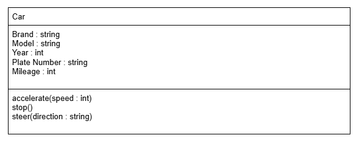

# SG4 - Understanding Classes and Objects
## Car
## It is a 4-wheeled vehicle used for transportation.
## Brand, Model, Year, Plate Number
| Property | Data Type | Description |
|---|---|---|
| Brand | string | Brand of the car |
| Model | string | Model of the car |
| Year | int | Year of the car |
| Plate Number | string | Plate Number of the car |
| Mileage | int | Number of miles travelled by the car |
## Methods
| Method | Description |
|---|---|
| accelerate(speed : int) | Accelerates the car to move faster |
| stop() | Stops the car from moving |
| steer(direction : string) | Changes the direction of the car |
## Class Diagram

## Design Explanation
### I chose car as my class because I like cars and it is a common vehicle that is used for transportation. Also, a car has many properties and methods that can be represented in a class.
### In my opinion, the property that is the most important is plate number because it helps in finding a specific car.
### In my opinion, the method that is the most important is accelerate because it makes the car move faster which helps it reach its destination in a shorter time.