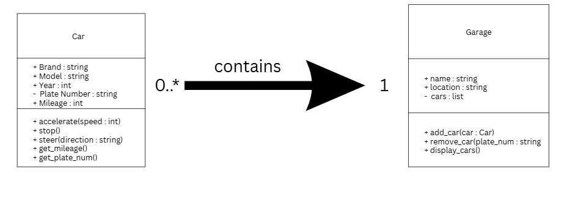
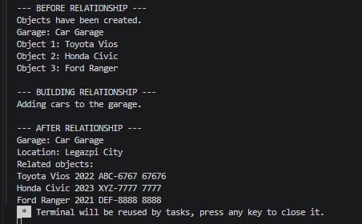
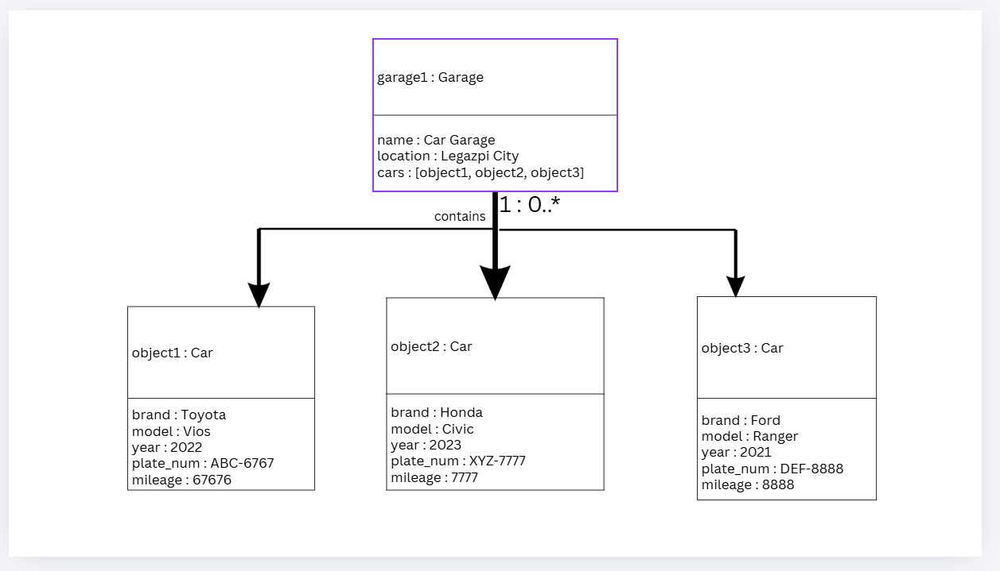

# Class Relationships: Association and Multiplicity
## Previous Work
[Part I - Classes and Objects](classObjectUML.md)
[Part II - Class Attributes and Methods](classAttributesMethods.md)
## Existing Class
Class: Car
Description: It is a 4-wheeled vehicle used for transportation.
## New Related Class
Class: Garage
Description: It is a place where cars are stored. It can show information of the cars inside it.
## Association
Relationship: Garage contains car
Explanation: The Garage class is related to car because a garage contain cars. The Garage can access the information of the cars.
## Multiplicity
Multiplicity: 1:0..*
Explanation: A garage can contain 0 or more cars because it can be empty or contain many cars.
## UML Class Relationship Diagram

## Python Implementation
[View Python Source](classRelationships.py)
## Test Run

## Object Relationship Diagram

## Analysis
### The association between my two classes is that a Garage contains Cars. The Garage is connected to the Car because cars can be placed inside a garage. In my example, garage1 contains object1, object2, and object3.
### I chose a 1:0..* relationship because one Garage can have zero or more Cars. A garage can be empty, or it can have many cars inside it. In my example, garage1 has three Cars.
### I used a cars list inside the Garage class to store the Cars. I made the list using self.cars = []. Then, the add_car() method adds Car objects to the list.
### I stored the actual Car object so the Garage can use the information from that Car. For example, garage1.add_car(object1) adds object1 to the Garage. This lets the Garage access things like the car's brand, model, and mileage.
### A list is useful because one Garage can have many Cars. The list contains the actual Car objects, such as object1, object2, and object3. This allows me to go through the list and get information about each car.