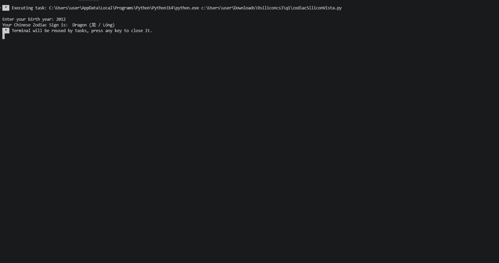

# Chinese Zodiac

## Requirements

1. Ask the user to enter a year of birth.  
2. The baseline year is 1900.
3. Validate user input that it should not be earlier than 1900.
4. If the user enters a year earlier than 1900, display an appropriate message then stop or abort the program.
5. If the user enters a year that is not earlier than 1900, determine the chinese zodiac sign based on the year of birth.
6. A chinese zodiac sign will recur after each 12 years.
7. The following chinese zodiac signs will be used: 
    - Rat (鼠 / Shǔ)
    - Ox (牛 / Niú)
    - Tiger (虎 / Hǔ)
    - Rabbit (兔 / Tù)
    - Dragon (龙 / Lóng)
    - Snake (蛇 / Shé)
    - Horse (马 / Mǎ)
    - Goat (羊 / Yáng)
    - Monkey (猴 / Hóu)
    - Rooster (鸡 / Jī)
    - Dog (狗 / Gǒu)
    - Pig (猪 / Zhū)
8. Consider only the year of birth
9. Test and run the code before submitting.

## Actual Code

```python
birth_year = int(input("Enter your birth year: "))
if birth_year < 1900:
    print("Invalid Year, it should not be earlier than 1900")
else:
    zodiac_number = (birth_year - 1900) % 12
    if zodiac_number == 0:
        zodiac_sign = "Rat (鼠 / Shǔ)"
    elif zodiac_number == 1:
        zodiac_sign = "Ox (牛 / Niú)"
    elif zodiac_number == 2:
        zodiac_sign = "Tiger (虎 / Hǔ)"
    elif zodiac_number == 3:
        zodiac_sign = "Rabbit (兔 / Tù)"
    elif zodiac_number == 4:
        zodiac_sign = "Dragon (龙 / Lóng)"
    elif zodiac_number == 5:
        zodiac_sign = "Snake (蛇 / Shé)"
    elif zodiac_number == 6:
        zodiac_sign = "Horse (马 / Mǎ)"
    elif zodiac_number == 7:
        zodiac_sign = "Goat (羊 / Yáng)"
    elif zodiac_number == 8:
        zodiac_sign = "Monkey (猴 / Hóu)"
    elif zodiac_number == 9:
        zodiac_sign = "Rooster (鸡 / Jī)"
    elif zodiac_number == 10:
        zodiac_sign = "Dog (狗 / Gǒu)"
    elif zodiac_number == 11:
        zodiac_sign = "Pig (猪 / Zhū)"
    print("Your Chinese Zodiac Sign is: ", zodiac_sign)
```
## Screenshot of Output

